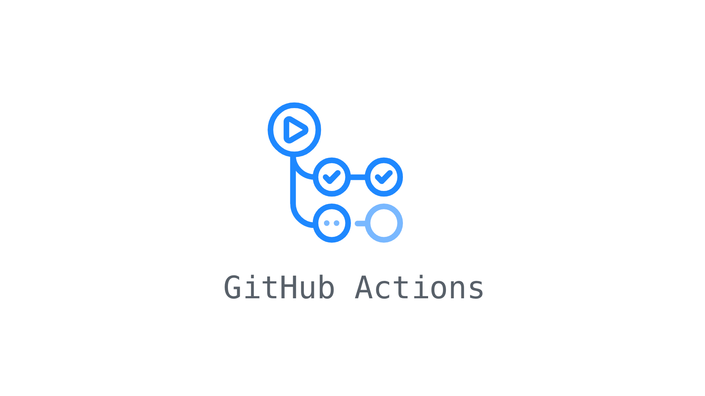
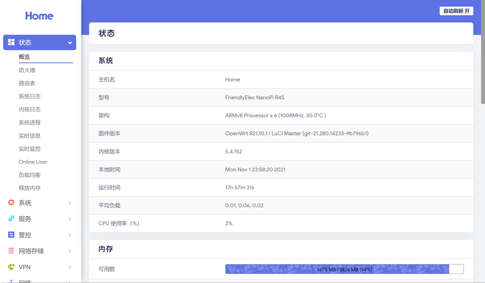
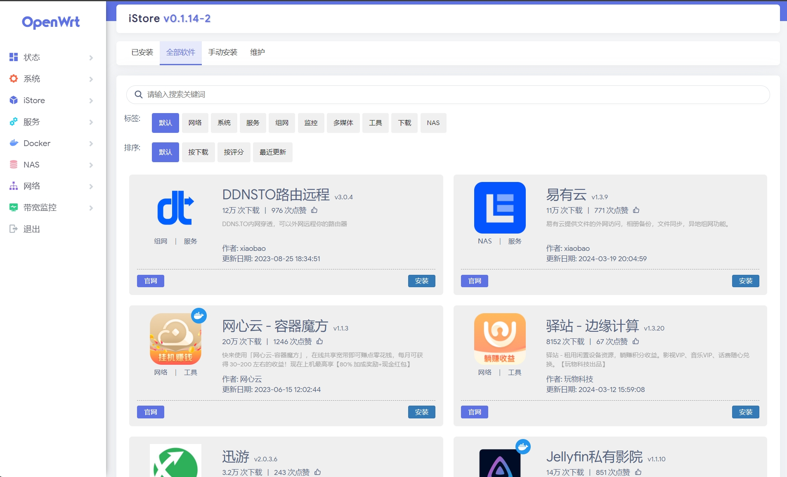
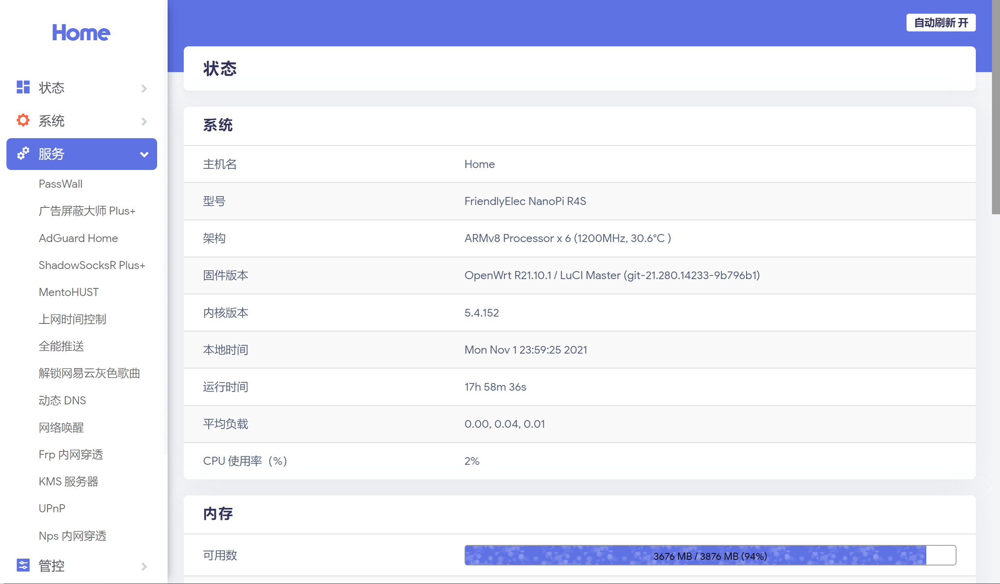
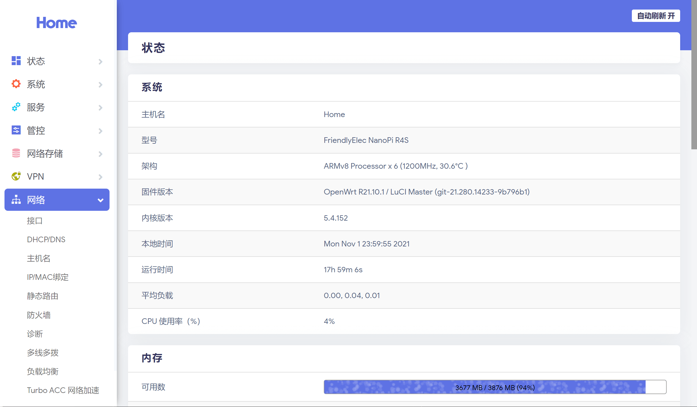

# OpenWrts

[English](./README.md) | [简体中文](./README.zh-CN.md)

OpenWrts builds OpenWrt firmware with GitHub Actions. 

<p align="center">
  
</p>


## Firmware Builds

The firmware build list is synchronized into [`manifests/builds.json`](./manifests/builds.json) from config fragments under `configs/` when workflow generation runs. The scheduled workflow controls timed releases and alternates between LEDE and ImmortalWrt in `auto` mode.

| Source | Device ID | Platform | Flavor | Workflow status | Downloads |
| --- | --- | --- | --- | --- | --- |
| `lede` | `x86_64` | x86_64 generic | `standard` |  |  |
| `lede` | `rpi3` | Raspberry Pi 3B/3B+ | `standard` |  |  |
| `lede` | `rpi4` | Raspberry Pi 4B | `standard` |  |  |
| `lede` | `rpi5` | Raspberry Pi 5 | `standard` |  |  |
| `lede` | `rockchip` | R68S, NanoPi R2S/R4S/R5C/R5S, Orange Pi R1 Plus | `standard` |  |  |
| `immortalwrt` | `x86_64` | x86_64 generic | `lite` |  |  |
| `immortalwrt` | `rpi3` | Raspberry Pi 3B/3B+ | `lite` |  |  |
| `immortalwrt` | `rpi4` | Raspberry Pi 4B | `lite` |  |  |
| `immortalwrt` | `rpi5` | Raspberry Pi 5 | `lite` |  |  |
| `immortalwrt` | `rockchip` | R68S, NanoPi R2S/R4S/R5C/R5S, Orange Pi R1 Plus | `lite` |  |  |

## LuCI Plugins

### LEDE Standard

| Category | Plugins |
| --- | --- |
| Store and proxy | `luci-app-store`, `luci-app-openclash`, `luci-app-passwall2`, `luci-app-ssr-plus` |
| Network | `luci-app-ddns`, `luci-app-mwan3`, `luci-app-n2n`, `luci-app-openvpn`, `luci-app-softethervpn`, `luci-app-syncdial`, `luci-app-upnp`, `luci-app-wireguard`, `luci-app-zerotier`, `luci-app-smartdns` |
| Services | `luci-app-adguardhome`, `luci-app-docker`, `luci-app-dockerman`, `luci-app-filebrowser`, `luci-app-frpc`, `luci-app-nfs`, `luci-app-nps`, `luci-app-samba4`, `luci-app-ttyd`, `luci-app-vsftpd` |
| System and tools | `luci-app-accesscontrol`, `luci-app-arpbind`, `luci-app-autoreboot`, `luci-app-cifs-mount`, `luci-app-commands`, `luci-app-control-timewol`, `luci-app-diskman`, `luci-app-filetransfer`, `luci-app-firewall`, `luci-app-netdata`, `luci-app-nlbwmon`, `luci-app-onliner`, `luci-app-pushbot`, `luci-app-qos`, `luci-app-serverchan`, `luci-app-usb-printer`, `luci-app-vlmcsd`, `luci-app-wol` |
| Extra apps | `luci-app-ipsec-vpnd`, `luci-app-mentohust`, `luci-app-oaf`, `luci-app-qbittorrent_static`, `luci-app-qbittorrent-simple_dynamic`, `luci-app-turboacc` |
| Themes | `luci-theme-argon`, `luci-theme-bootstrap`, `luci-theme-infinityfreedom`, `luci-theme-material`, `luci-theme-netgear`, `luci-theme-neobird` |

### ImmortalWrt Lite

| Category | Plugins |
| --- | --- |
| Store and proxy | `luci-app-store`, `luci-app-openclash`, `luci-app-passwall2`, `luci-app-ssr-plus` |
| Network | `luci-app-accesscontrol`, `luci-app-smartdns`, `luci-app-turboacc`, `luci-proto-wireguard` |
| Services | `luci-app-docker`, `luci-app-dockerman`, `luci-app-filetransfer`, `luci-app-firewall`, `luci-app-netdata`, `luci-app-oaf`, `luci-app-onliner`, `luci-app-ttyd` |
| System defaults | `default-settings`, `default-settings-chn`, `luci-app-autoreboot` |
| Themes | `luci-theme-argon`, `luci-theme-bootstrap`, `luci-theme-material` |

## Supported Sources

| Source ID | Upstream repository | Default branch | Notes |
| --- | --- | --- | --- |
| `lede` | <https://github.com/coolsnowwolf/lede> | `master` | Lean LEDE, currently used for standard builds |
| `immortalwrt` | <https://github.com/immortalwrt/immortalwrt> | `master` | ImmortalWrt, currently used for shared lite builds |

The two sources do not share the same SDK, feeds, LuCI version, package set, or plugin compatibility guarantees. High-confidence shared fragments live under `common`; source-specific fragments remain isolated and take precedence when they use the same name.

## Workflows

| Workflow | Purpose |
| --- | --- |
| [`schedule-release.yml`](./.github/workflows/schedule-release.yml) | Scheduled release. `auto` mode alternates between LEDE and ImmortalWrt by ISO week parity |
| [`manual-build.yml`](./.github/workflows/manual-build.yml) | Manual build entry point with source, device, flavor, branch, and release controls |
| [`build-openwrt.yml`](./.github/workflows/build-openwrt.yml) | Reusable workflow that builds one matrix item |

The scheduled workflow uses UTC:

```yaml
schedule:
  - cron: "23 16 * * 6"
```

This is roughly Sunday 00:23 in Asia/Shanghai.

## Build Flow

```text
scheduled/manual workflow
  -> scripts/openwrts.mjs validate-manifest
  -> scripts/openwrts.mjs generate-workflows --check
  -> scripts/openwrts.mjs resolve-matrix generates the build matrix
  -> build-openwrt.yml
     -> scripts/prepare-env.sh
     -> scripts/clone-source.sh
     -> scripts/apply-openwrt.sh system feeds
     -> OpenWrt feeds update/install
     -> scripts/apply-openwrt.sh packages
     -> scripts/compose-config.sh
     -> scripts/build.sh
     -> upload artifact / release
```

## Repository Layout

```text
.github/workflows/
  build-openwrt.yml      reusable build workflow
  schedule-release.yml   scheduled source-rotation release workflow
  manual-build.yml       manual build workflow

manifests/
  builds.json            build matrix definition

feeds/
  common.conf            shared feed overlays
  <repo>.conf            optional repo-only feed overlays

packages/
  lede.sh                LEDE third-party packages
  immortalwrt.sh         ImmortalWrt third-party packages

configs/
  targets/               shared target/device configs
  apps/                  common and source-specific LuCI app configs
  drivers/               source-specific driver extension configs

scripts/
  openwrts.mjs           Node.js CLI for manifest validation, matrix resolution, and workflow generation
  prepare-env.sh         install build dependencies
  clone-source.sh        clone the selected upstream source
  apply-openwrt.sh       apply system defaults, shared/repo feeds, and repo packages
  compose-config.sh      compose .config and run make defconfig
  build.sh               download dependencies and compile firmware
```

The old root-level `source.sh`, `environment.sh`, `configure.sh`, and `package.sh` compatibility wrappers have been removed. New automation should call scripts under `scripts/` directly.

## Workflow Generation

GitHub Actions `workflow_dispatch` choice options are static YAML values. They cannot be loaded dynamically at runtime in the Actions UI. Regenerate after changing target, app, or driver config fragments:

```powershell
node scripts\openwrts.mjs generate-workflows
node scripts\openwrts.mjs generate-workflows --check
```

`generate-workflows` scans shared targets from `configs/targets/*.config`, combines them with `configs/apps/common/*.config` and selected `configs/apps/<repo>/*.config` fragments, updates `manifests/builds.json`, and then writes the workflow options. Repo-specific app fragments take precedence over same-named common app fragments. Existing manifest metadata such as `op_name` is preserved, so you can edit display names after the first generation.

The generated workflows contain a validation step that fails when committed manifest or workflow options are out of sync with the config fragments.

## Cache Strategy

The new workflow caches `dl` and `.ccache` with `actions/cache`. The cache key includes:

```text
repo + branch + cache_scope + hash(feeds/packages/scripts/configs/manifests)
```

This avoids reusing incompatible cache data across LEDE, ImmortalWrt, devices, and firmware flavors.

## Default Firmware Settings

- Management IP: `192.168.10.1`
- User: `root`
- Password: `password`

## Manual Builds

Open GitHub Actions and run `Manual OpenWrt Build`, then choose:

- `repo`: `auto`, `lede`, or `immortalwrt`. Use `auto` to resolve the source from the selected device; for `device=all`, `auto` follows the scheduled rotation rule.
- `device`: `all` or a device ID from the matrix
- `flavor`: `standard`, `lite`, or `all`. The default is `standard` with `repo=lede`. Use `all` when you want every matching manifest entry for the selected repo/device.
- `branch`: leave empty to use the manifest default, or provide an upstream branch
- `upload_release`: whether to upload firmware to GitHub Releases

For example, `repo=lede`, `device=all`, `flavor=lite` builds all LEDE targets with `configs/apps/common/lite.config`. If a selected repo/device/flavor combination does not exist, matrix resolution stops before compilation and reports the available flavors.

## Local Matrix Checks

```powershell
node scripts\openwrts.mjs validate-manifest
node scripts\openwrts.mjs resolve-matrix --repo lede --device x86_64
node scripts\openwrts.mjs resolve-matrix --repo immortalwrt --device all
node scripts\openwrts.mjs resolve-matrix --repo auto
```

The Node.js CLI uses only built-in Node modules and does not require `npm install`.

## Adding a Device

1. Add the target/device config under `configs/targets/`.
2. Add or reuse an app config under `configs/apps/common/` or `configs/apps/<repo>/`.
3. Add driver extensions under `configs/drivers/<repo>/` when needed.
4. Update `packages/<repo>.sh` if the device needs extra packages.
5. Run `node scripts\openwrts.mjs generate-workflows` to sync `manifests/builds.json` and workflow choices.
6. Optionally edit the generated `op_name` in `manifests/builds.json` for a nicer release name, then rerun `generate-workflows`.
7. Run `node scripts\openwrts.mjs validate-manifest`.

## Screenshots









## Credits

- <https://github.com/P3TERX/Actions-OpenWrt>
- <https://github.com/coolsnowwolf/lede>
- <https://github.com/immortalwrt/immortalwrt>
- <https://github.com/jerrykuku/luci-theme-argon>
- <https://github.com/linkease/istore>

## License

This project is released under the MIT License. See [`LICENSE`](./LICENSE).
