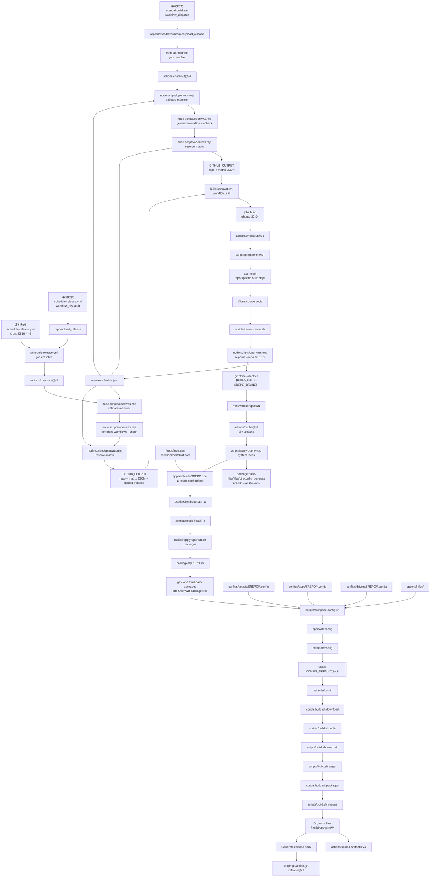
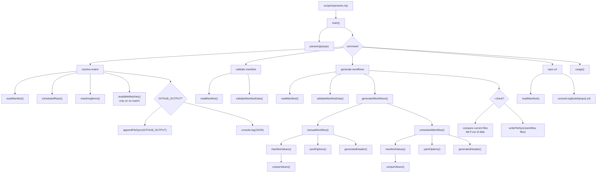

# OpenWrts 当前调用图

本文基于当前仓库结构生成，覆盖 GitHub Actions、Node.js 控制脚本、Bash 执行脚本、manifest/config/feeds/packages 输入，以及 artifact/release 输出链路。

## 总调用图

## Node.js CLI 调用图

## Bash 脚本调用图

```mermaid
flowchart TD
    BuildWorkflow["build-openwrt.yml"] --> Prepare["scripts/prepare-env.sh"]
    BuildWorkflow --> Clone["scripts/clone-source.sh"]
    BuildWorkflow --> Apply["scripts/apply-openwrt.sh"]
    BuildWorkflow --> Compose["scripts/compose-config.sh"]
    BuildWorkflow --> Build["scripts/build.sh"]

    Prepare --> RepoCase["case $REPO"]
    RepoCase --> AptLede["apt install LEDE deps"]
    RepoCase --> AptImmortal["apt install ImmortalWrt deps"]

    Clone --> RepoUrlCall["node scripts/openwrts.mjs repo-url"]
    RepoUrlCall --> GitClone["git clone --depth 1"]

    Apply --> ArgParser["parse modes<br/>system/feeds/packages/all"]
    ArgParser --> ResolveOpenWrtDir["resolve_openwrt_dir()"]
    ArgParser --> ApplySystem["apply_system()"]
    ArgParser --> ApplyFeeds["apply_feeds()"]
    ArgParser --> ApplyPackages["apply_packages()"]

    ApplySystem --> SedLanIp["sed 192.168.1.1 -> 192.168.10.1"]
    ApplyFeeds --> RepoFeeds["feeds/$REPO.conf"]
    RepoFeeds --> AppendFeeds["cat >> openwrt/feeds.conf.default"]
    ApplyPackages --> PackageScript["packages/$REPO.sh"]
    PackageScript --> ClonePackage["clone_package(repo_url, dest)"]
    ClonePackage --> PackageGitClone["git clone --depth 1"]

    Compose --> ResolveTarget["resolve_path($TARGET_CONFIG)"]
    Compose --> ResolveApp["resolve_path($APP_CONFIG)"]
    Compose --> ResolveDriver["resolve_path($DRIVER_CONFIG)"]
    Compose --> CopyFiles["copy optional root files/"]
    Compose --> WriteConfig["cat target + driver + app<br/>to openwrt/.config"]
    WriteConfig --> MakeDefconfigA["make defconfig"]
    MakeDefconfigA --> AwkDefaultLuci["awk unset CONFIG_DEFAULT_luci*"]
    AwkDefaultLuci --> MakeDefconfigB["make defconfig"]

    Build --> Phase{"phase"}
    Phase --> Download["download_sources()<br/>make download + remove tiny dl files"]
    Phase --> Tools["run_make tools/install"]
    Phase --> Toolchain["run_make toolchain/install"]
    Phase --> Target["run_make target/compile"]
    Phase --> Packages["run_make package/compile"]
    Phase --> Images["run_make package/install<br/>target/install<br/>package/index"]
    Phase --> All["download_sources()<br/>run_make world"]
```

## 调用关系速查

| Caller | Callee | Purpose |
| --- | --- | --- |
| `manual-build.yml` | `node scripts/openwrts.mjs validate-manifest` | Validate manifest before resolving manual matrix. |
| `manual-build.yml` | `node scripts/openwrts.mjs generate-workflows --check` | Ensure generated workflow options are committed. |
| `manual-build.yml` | `node scripts/openwrts.mjs resolve-matrix` | Convert manual inputs into matrix JSON. |
| `schedule-release.yml` | `node scripts/openwrts.mjs resolve-matrix` | Resolve scheduled repo rotation or selected repo. |
| `build-openwrt.yml` | `scripts/prepare-env.sh` | Install build dependencies. |
| `build-openwrt.yml` | `scripts/clone-source.sh` | Clone selected upstream OpenWrt source. |
| `scripts/clone-source.sh` | `node scripts/openwrts.mjs repo-url` | Resolve upstream URL from manifest. |
| `build-openwrt.yml` | `scripts/apply-openwrt.sh system feeds` | Apply LAN IP default and append feeds. |
| `build-openwrt.yml` | `./scripts/feeds update -a` | Update OpenWrt feeds inside upstream tree. |
| `build-openwrt.yml` | `./scripts/feeds install -a` | Install OpenWrt feed packages inside upstream tree. |
| `build-openwrt.yml` | `scripts/apply-openwrt.sh packages` | Clone repo-specific third-party packages. |
| `scripts/apply-openwrt.sh` | `packages/<repo>.sh` | Run package clone script for selected repo. |
| `build-openwrt.yml` | `scripts/compose-config.sh` | Compose final OpenWrt `.config`. |
| `build-openwrt.yml` | `scripts/build.sh <phase>` | Run staged OpenWrt build phases. |
