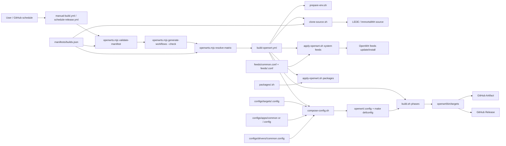
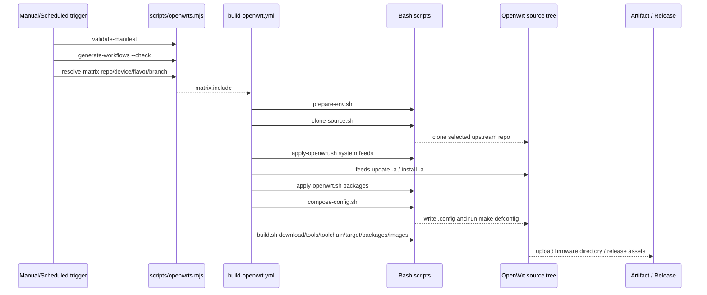

# OpenWrts Project Analysis And Architecture

## Project Role

OpenWrts is an OpenWrt firmware build orchestration repository. It does not vendor OpenWrt source code. Instead, it keeps build metadata, GitHub Actions workflows, shared/repo-specific config fragments, feeds, package clone scripts, and CI glue in one place.

The current design uses shared target fragments under `configs/targets/`, shared/repo-specific app fragments under `configs/apps/`, and repo-specific driver fragments under `configs/drivers/` as the scanned build inputs. `manifests/builds.json` is the generated matrix and metadata file, and `scripts/openwrts.mjs` is the Node.js control plane for manifest synchronization, validation, matrix resolution, workflow generation, and repo URL lookup.

Application config fragments can be shared by flavor, for example `configs/apps/common/lite.config`, while source-specific variants such as `configs/apps/lede/standard.config` stay isolated. This is because LEDE and ImmortalWrt do not have identical package sets or LuCI compatibility. The manual workflow uses a static global flavor selector, so its default is pinned to the valid `lede` + `standard` combination instead of `all`.

## Architecture



## Runtime Flow



## Core Modules

| Area | Files | Responsibility |
| --- | --- | --- |
| Build metadata | `configs/**`, `manifests/builds.json` | Shared target fragments plus shared/repo-specific app fragments define build combinations. The generated manifest stores repos, upstream URLs, branches, display names, config paths, and cache scopes. |
| Node control plane | `scripts/openwrts.mjs` | Validates the manifest, resolves build matrices, generates static workflow choices, and returns repo URLs. |
| Entrypoint workflows | `.github/workflows/manual-build.yml`, `.github/workflows/schedule-release.yml` | Static GitHub Actions UI entrypoints generated from the manifest. |
| Reusable build workflow | `.github/workflows/build-openwrt.yml` | Builds one resolved matrix item and uploads artifacts/releases. |
| Build dependencies | `scripts/prepare-env.sh` | Installs Ubuntu packages required by the selected upstream source. |
| Source clone | `scripts/clone-source.sh` | Uses `openwrts.mjs repo-url` plus `REPO_BRANCH` to clone the selected upstream source. |
| OpenWrt apply step | `scripts/apply-openwrt.sh` | Applies default system settings, shared/repo-specific feeds, and repo package scripts. |
| Config composition | `scripts/compose-config.sh` | Merges target, driver, and app config fragments into OpenWrt `.config`. |
| Compilation | `scripts/build.sh` | Runs OpenWrt download, tools, toolchain, target, packages, and image phases. |

## Manifest Model

`generate-workflows` scans `configs/targets/*.config`, `configs/apps/common/*.config`, and repo-specific app fragments to synchronize the device/flavor matrix into `manifests/builds.json`. Repo-specific app fragments take precedence over same-named common app fragments. Existing generated manifest metadata is preserved where possible, including custom `op_name` values.

Each repo entry in `manifests/builds.json` contains:

- `branch`: default upstream branch.
- `url`: upstream Git repository URL used by `clone-source.sh`.
- `devices`: build targets for that source repo.

The optional `workflow.manual` section controls static defaults used when generating `manual-build.yml`, including `default_repo`, `default_device`, and `default_flavor`. The `workflow.schedule` section controls the scheduled defaults for `repo`, comma-separated `devices`, and comma-separated `flavors`; the current policy is `auto`, all devices, and `lite`.

`repo=auto` always resolves to one source using ISO-week rotation. It no longer expands a selected device across every repository.

Each device entry contains:

- `id`: workflow device ID.
- `op_name`: artifact/release display name.
- `flavor`: firmware flavor, such as `standard` or `lite`.
- `target_config`: OpenWrt target/device config fragment.
- `app_config`: LuCI app/theme/package config fragment.
- `driver_config`: optional driver extension config fragment.
- `cache_scope`: GitHub Actions cache isolation key segment.

## Workflow Generation

GitHub Actions `workflow_dispatch` choice options are static YAML. They cannot be loaded dynamically from `manifests/builds.json` when the user opens the Actions UI.

OpenWrts therefore synchronizes the manifest and generates workflow files in one step:

```powershell
node scripts\openwrts.mjs generate-workflows
node scripts\openwrts.mjs generate-workflows --check
```

The generated workflows also run `generate-workflows --check` during the resolve job so CI fails if committed manifest or workflow choices drift from the config fragments.

## Validation

Use these checks after manifest, workflow, or matrix changes:

```powershell
node scripts\openwrts.mjs validate-manifest
node scripts\openwrts.mjs generate-workflows --check
node scripts\openwrts.mjs resolve-matrix --repo lede --device x86_64
node scripts\openwrts.mjs resolve-matrix --repo immortalwrt --device all
node scripts\openwrts.mjs resolve-matrix --repo auto
```

Full OpenWrt builds are network-heavy and should normally run in GitHub Actions.

## Extension Path

When adding a device:

1. Add or reuse config fragments under `configs/targets/`, `configs/apps/common/`, `configs/apps/<repo>/`, and `configs/drivers/<repo>/`.
2. Update `packages/<repo>.sh`, `feeds/common.conf`, or `feeds/<repo>.conf` only if the device needs additional package sources.
3. Run `node scripts\openwrts.mjs generate-workflows` to sync `manifests/builds.json` and workflow choices.
4. Optionally adjust generated manifest metadata such as `op_name`, then rerun `generate-workflows`.
5. Run `node scripts\openwrts.mjs validate-manifest`.

When adding an upstream source repo, also update `prepare-env.sh`, add source-specific feeds/packages/configs, and let workflow generation publish the new repo option.
