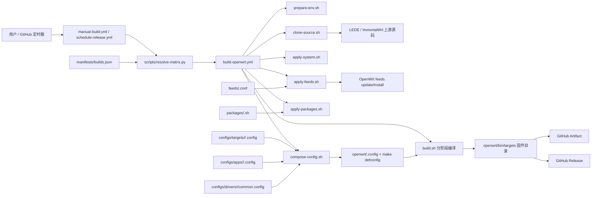
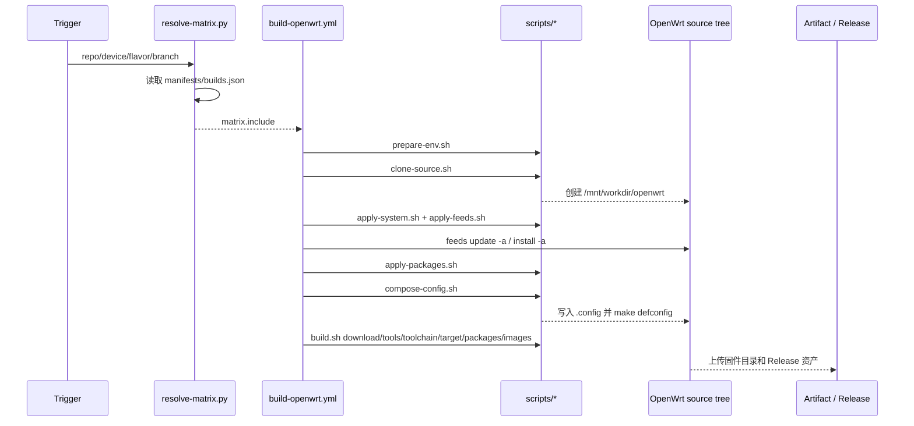

# OpenWrts 项目分析与架构图

## 项目定位

OpenWrts 是一个基于 GitHub Actions 的 OpenWrt 固件云编译仓库。项目本身不保存 OpenWrt 源码，而是维护一套可重复执行的构建编排：

- 通过 `manifests/builds.json` 定义可构建的上游源码、设备、风格和配置片段。
- 通过 `.github/workflows/` 提供定时构建、手动构建和单项构建复用流程。
- 通过 `scripts/` 完成环境准备、源码克隆、系统默认值、feeds、第三方包、`.config` 合成和分阶段编译。
- 通过 `configs/`、`feeds/`、`packages/` 按上游源码隔离配置差异，降低 LEDE 与 ImmortalWrt 混用造成的兼容风险。

## 架构总览



## 构建时序



## 核心模块

| 模块 | 关键文件 | 职责 |
| --- | --- | --- |
| 构建入口 | `.github/workflows/manual-build.yml`, `.github/workflows/schedule-release.yml` | 接收手动参数或定时触发，调用矩阵解析，再复用单项构建 workflow。 |
| 单项构建 | `.github/workflows/build-openwrt.yml` | 编排一条具体固件构建任务，包括缓存、依赖、源码、配置、编译、上传。 |
| 构建矩阵 | `manifests/builds.json`, `scripts/resolve-matrix.py` | 定义并解析 repo、device、flavor、配置文件路径、cache scope、默认分支。 |
| 上游源码 | `scripts/clone-source.sh` | 按 `REPO` 和 `REPO_BRANCH` 拉取 LEDE 或 ImmortalWrt。 |
| 环境依赖 | `scripts/prepare-env.sh` | 按上游源码安装 Ubuntu 构建依赖。 |
| 系统默认值 | `scripts/apply-system.sh` | 修改 OpenWrt 默认 LAN IP 为 `192.168.10.1`。 |
| feeds | `feeds/<repo>.conf`, `scripts/apply-feeds.sh` | 追加第三方 feeds 到上游 `feeds.conf.default`。 |
| 第三方包 | `packages/<repo>.sh`, `scripts/apply-packages.sh` | 克隆源码树外部包，按上游源码隔离冲突包。 |
| 配置合成 | `configs/**`, `scripts/compose-config.sh` | 将 target、driver、app 片段合成为 OpenWrt `.config`。 |
| 编译阶段 | `scripts/build.sh` | 执行 download、tools、toolchain、target、packages、images 等阶段。 |
| 兼容入口 | `source.sh`, `environment.sh`, `configure.sh`, `package.sh` | 保留旧脚本入口，转发到 `scripts/` 下的新实现。 |

## 数据模型

`manifests/builds.json` 是构建定义的单一事实源。每个设备项包含：

- `id`: workflow 输入使用的设备 ID。
- `op_name`: Release 和 artifact 展示名。
- `flavor`: 固件风格，例如 `standard` 或 `lite`。
- `target_config`: 目标平台和设备配置片段。
- `app_config`: LuCI 应用、主题和功能包配置片段。
- `driver_config`: 可选驱动扩展配置片段。
- `cache_scope`: GitHub Actions 缓存隔离键的一部分。

当前构建矩阵：

| repo | branch | device | flavor | target |
| --- | --- | --- | --- | --- |
| `lede` | `master` | `x86_64` | `standard` | x86_64 generic |
| `lede` | `master` | `rpi3` | `standard` | Raspberry Pi 3 |
| `lede` | `master` | `rpi4` | `standard` | Raspberry Pi 4 |
| `lede` | `master` | `rpi5` | `standard` | Raspberry Pi 5 |
| `lede` | `master` | `rockchip` | `standard` | R68S、NanoPi R2S/R4S/R5C/R5S、Orange Pi R1 Plus |
| `immortalwrt` | `master` | `x86_64` | `lite` | x86_64 generic |

## 配置合成规则

`scripts/compose-config.sh` 按固定顺序生成最终 `.config`：

1. 清空 `openwrt/.config`。
2. 写入 `target_config`。
3. 如果存在 `driver_config`，写入驱动配置。
4. 写入 `app_config`。
5. 执行 `make defconfig`。
6. 将 `CONFIG_DEFAULT_luci...=y` 转换为显式 unset，避免默认 LuCI 包污染选择。
7. 再次执行 `make defconfig` 并输出最终配置。

这种顺序意味着 target 决定平台，driver 补足硬件能力，app 决定固件功能面。

## CI 与缓存策略

`build-openwrt.yml` 缓存 `/mnt/workdir/openwrt/dl` 和 `/mnt/workdir/openwrt/.ccache`。缓存 key 包含：

```text
repo + branch + cache_scope + hash(feeds/packages/scripts/configs/manifests)
```

这个设计可以避免不同上游、设备和固件风格复用不兼容缓存，同时在配置未变时复用下载包和编译缓存。

## 主要扩展路径

添加新设备时，建议按以下顺序修改：

1. 在 `configs/targets/<repo>/` 新增设备 target 配置。
2. 复用或新增 `configs/apps/<repo>/<flavor>.config`。
3. 需要额外驱动时，更新或新增 `configs/drivers/<repo>/` 配置。
4. 在 `manifests/builds.json` 添加设备项，并给出唯一 `cache_scope`。
5. 如果依赖新第三方源码，更新 `feeds/<repo>.conf` 或 `packages/<repo>.sh`。
6. 更新 `manual-build.yml` 的 `device` 或 `flavor` 可选项。
7. 运行矩阵解析命令验证。

添加新上游源码时，需要新增更多配套项：

- `scripts/prepare-env.sh` 的依赖分支。
- `scripts/clone-source.sh` 的仓库 URL 分支。
- `feeds/<repo>.conf`。
- `packages/<repo>.sh`。
- `configs/targets/<repo>/`、`configs/apps/<repo>/`、`configs/drivers/<repo>/`。
- `manifests/builds.json` 的 repo 节点。
- workflow 输入选项和 README。

## 验证命令

这些命令不会触网，适合在改动 manifest 或矩阵逻辑后先跑：

```powershell
python scripts\resolve-matrix.py --repo lede --device x86_64
python scripts\resolve-matrix.py --repo immortalwrt --device all
python scripts\resolve-matrix.py --repo auto
```

完整固件构建依赖上游源码、第三方 feeds、Ubuntu 构建依赖和较长编译时间，建议优先交给 GitHub Actions 执行。

## 风险点

- LEDE 与 ImmortalWrt 的包名、默认包、LuCI 版本和内核模块兼容性不完全一致，跨 repo 复制配置前要验证。
- `packages/immortalwrt.sh` 已跳过 `kenzok8/small-package`，说明该上游存在已知包冲突风险。
- `manual-build.yml` 的输入选项需要和 `manifests/builds.json` 同步，否则新增设备无法从 UI 选择。
- `apply-system.sh` 直接修改上游 `config_generate`，上游路径或默认 IP 文本变化时可能失效。
- `compose-config.sh` 会复制根目录 `files/` 到 OpenWrt 源码树，如果后续新增 `files/`，需要把它纳入配置审查范围。
- `README.zh-CN.md` 需要注意编码一致性，避免中文内容在 Windows 终端或网页中出现乱码。
